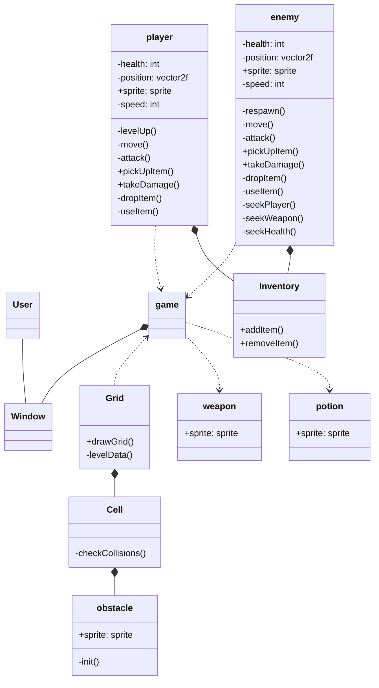

```mermaid
classDiagram
direction TB
    class weapon {
	    +sprite: sprite
    }

    class obstacle {
	    +sprite: sprite
	    -init()
    }

    class potion {
	    +sprite: sprite
    }

    class User {
    }

    class player {
	    -health: int
	    -position: vector2f
	    +sprite: sprite
	    -speed: int
	    -levelUp()
	    -move()
	    -attack()
	    +pickUpItem()
	    +takeDamage()
	    -dropItem()
	    -useItem()
    }

    class Window {
    }

    class enemy {
	    -health: int
	    -position: vector2f
	    +sprite: sprite
	    -speed: int
	    -respawn()
	    -move()
	    -attack()
	    +pickUpItem()
	    +takeDamage()
	    -dropItem()
	    -useItem()
	    -seekPlayer()
	    -seekWeapon()
	    -seekHealth()
    }

    class Inventory {
	    +addItem()
	    +removeItem()
    }

    class Grid {
	    +drawGrid()
	    -levelData()
    }

    class Cell {
	    -checkCollisions()
    }

    class game{


    }

    User -- Window
    game *-- Window
    game <.. Grid
    game ..> weapon
    game ..> potion
    player ..> game
    enemy ..> game
    player *-- Inventory
    enemy *-- Inventory
    Grid *-- Cell
    Cell *-- obstacle
```
